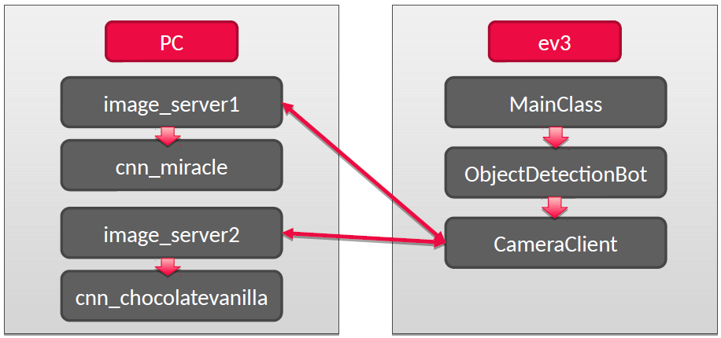

# Робот для обнаружения и транспортировки заданного объекта
[ссылка на видео](https://youtu.be/hAr5yhyaINA)

Что было сделано:
1. Установлена альтернативная прошивка leJOS
2. Подключена web-камера к ev3
3. Раработаны два вспомогательных класса на ev3:
    - захват, конвертация и отправка изображения на компьютер
    - поиск объекта
4. Разработаны две нейронных сети:
    - распознавание бутылочек «чудо» относительно других объектов
    - распознавание этикеток бутылочек

Этапы программы:
1. Инициализация камеры, моторов, датчиков.
2. Проход комнаты по линии и параллельный поиск объектов.
3. При нахождении объекта ультразвуковым дальномером – поворот к нему и захват изображения.
4. Если объект не является «чудом», то продолжение движения по линии, иначе – приближение к объекту на расстояние 15 см.
5. После приближения повторный захват изображения и распознавание этикетки.
6. Если объект не является целевым, то возвращение на линию и продолжение поиска. Если же объект – целевой, то захват цели и возвращение на начальную точку.

Используемые технологии:
1. На стороне пк: Python3 с библиотеками Numpy, OpenCV, TensorFlow, TFLearn;
2. На стороне Ev3: leJOS + Java.

